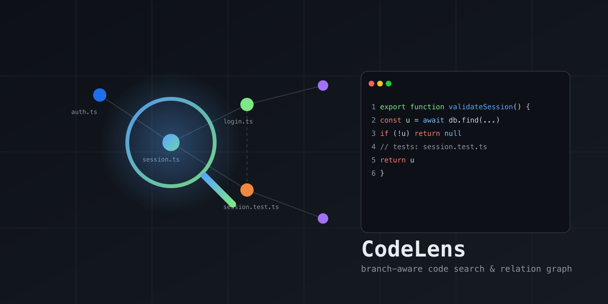

# CodeLens



A local, **branch-aware code search & relation graph** — a lens into how
the code in a repo connects. Indexes the current branch into SQLite (FTS5
lexical + tree-sitter symbols + source-graph edges: imports / tests / calls /
defines / belongs_to) and returns compact, ranked, re-queryable handles so you
can find relevant files/symbols and walk their relationships without flooding
your context with raw grep/read output.

No chat LLM is involved — retrieval is deterministic. Surfaced as an **MCP
server** and a **CLI**; works with any MCP-compatible client (Claude Code,
Cursor, Gemini CLI, opencode, Codex CLI) or directly from the terminal.

- **Branch isolation** — each branch/worktree has its own index; results never
  leak across branches.
- **Relations, not just text** — graph edges (imports / tests / callers / …)
  ranked alongside FTS5 + symbol-name matches.
- **Fresh** — query tools auto-refresh changed files before answering, flag
  budget-limited stale results, and `cl_expand` always reads from disk.
- **Compact** — returns ranked handles; expand only what you need.
- **Durable** — saved contexts live in a separate DB and survive index rebuilds.
- **Self-cleaning** — automatic TTL prunes inactive indexes.

## Install

One command builds the tool, installs the `codelens` launcher, and wires the MCP
server into detected agents/IDEs automatically (Claude Code, Cursor, Gemini CLI,
opencode, Codex CLI). Requires Node.js ≥ 22.5.

**macOS / Linux:**
```bash
curl -fsSL https://raw.githubusercontent.com/ex-git/codeLens/main/install.sh | sh
```

**Windows (PowerShell):**
```powershell
irm https://raw.githubusercontent.com/ex-git/codeLens/main/install.ps1 | iex
```

After it finishes, open a new terminal so your shell picks up the newly installed
`codelens` command. The agents detected during install are already configured;
to choose targets explicitly or re-run later:

```bash
codelens install --target all --yes        # wire all agents
codelens install --target claude,cursor    # wire specific agents
codelens install --target auto --location=local   # project-local config
codelens --print-config codex              # print a snippet, no writes
codelens uninstall                         # remove from all agents
```

**Upgrade:**
```bash
codelens upgrade --check   # is an update available?
codelens upgrade           # git pull + rebuild + refresh global agent config/routing
```
Upgrade reports the rebuilt version and re-applies global agent config + routing
for detected hosts. Cursor's global config attaches to the active workspace via
`${workspaceFolder}`, so after upgrading just restart your agent.

**Uninstall everything:**
```bash
curl -fsSL https://raw.githubusercontent.com/ex-git/codeLens/main/install.sh | sh -s -- --uninstall
```

> Note on clients/LLMs: MCP clients (Claude Code, Cursor, …) bring their own
> model — CodeLens has no LLM and configures none. The installer only wires the
> MCP server + routing instructions into each host's config.

## Supported agents / IDEs

The installer (`codelens install --target <id>`) writes the MCP server config
and routing instructions into each host's real config file. `--location=global`
(user-wide) is the default; `--location=local` writes project-local config
instead. All writes are idempotent and removable with `codelens uninstall`.

| Host | target id | Config file (global → local) | Entry shape |
|---|---|---|---|
| Claude Code | `claude` | `~/.claude.json` → `.mcp.json` | `mcpServers.codelens = { command, args: ["--auto-index", "missing"] }` (local also adds `--cwd <workspace>`) |
| Cursor | `cursor` | `~/.cursor/mcp.json` → `.cursor/mcp.json` | `mcpServers.codelens = { command, args: ["--cwd", "${workspaceFolder}", "--auto-index", "missing"] }` (Cursor expands the variable per-workspace) |
| Gemini CLI | `gemini` | `~/.gemini/settings.json` → `.gemini/settings.json` | `mcpServers.codelens = { command, args: ["--auto-index", "missing"] }` (local also adds `--cwd <workspace>`) |
| opencode | `opencode` | `~/.config/opencode/opencode.json` → `./opencode.json` | `mcp.codelens = { type: "local", command: [cmd, "--auto-index", "missing"], enabled: true }` (local also adds `--cwd <workspace>`) |
| Codex CLI | `codex` | `~/.codex/config.toml` → `.codex/config.toml` | TOML `[mcp_servers.codelens]` block (`command`, `args = ["--auto-index", "missing"]`; local also adds `--cwd <workspace>`) |
| Pi Coding Agent | `pi` | `pi install npm:@fodx/codelens` (loads `adapters/pi/codelens.extension.ts`) | Pi extension that bridges the MCP server via `pi.registerTool` |

`command` is the absolute path to the installed `codelens` launcher (written by
the installer); for a manual snippet use `npx -y @fodx/codelens`. CodeLens uses
root priority `--cwd` → MCP Roots → process cwd. **Cursor** config (global or
local) attaches to the active workspace via `--cwd ${workspaceFolder}`. Other
hosts pin the concrete workspace path for local installs and rely on MCP Roots
for global installs. Installed MCP configs default to `--auto-index missing`, so
CodeLens starts a detached background index when a workspace/branch has no
complete index yet; pass `--auto-index never` to disable.

**Routing instructions** are also written so the host prefers codelens tools for
discovery over raw grep/read:

| Host | Instructions file (global → local) |
|---|---|
| Claude Code | `~/.claude/CLAUDE.md` → `./CLAUDE.md` (+ slash commands in `~/.claude/commands/codelens-*.md`) |
| Cursor | `~/.cursor/rules/codelens.mdc` → `.cursor/rules/codelens.mdc` (dedicated, `alwaysApply`) |
| Gemini CLI | `~/.gemini/GEMINI.md` → `./GEMINI.md` |
| opencode | `~/.config/opencode/AGENTS.md` → `./AGENTS.md` |
| Codex CLI | `~/.codex/AGENTS.md` → `./AGENTS.md` |

**Print a snippet without writing anything:**

```bash
codelens --print-config claude    # JSON mcpServers snippet + target path
codelens --print-config codex     # TOML [mcp_servers.codelens] block
codelens --print-config pi        # Pi extension manifest pointer
```

**Pi Coding Agent** — install as a Pi package (the npm tarball ships the
extension under `adapters/pi/` and is tagged `pi-package`, so it appears in the
[Pi package gallery](https://pi.dev/packages) once published):

```bash
pi install npm:@fodx/codelens      # user-wide
pi install -l npm:@fodx/codelens   # project-local (.pi/settings.json)
pi -e npm:@fodx/codelens           # try it for one run without installing
```

> **npm discoverability:** `package.json` is tagged `pi-package` (required for
> the Pi gallery) plus descriptive keywords (`mcp-server`,
> `modelcontextprotocol`, `claude-code`, `cursor`, `gemini-cli`, `opencode`,
> `codex`) so the package is findable via npm search. Only `pi-package` is
> confirmed to trigger a host gallery listing; the others are for search
> discoverability and do not imply auto-listing in those hosts' marketplaces.

## Install (MCP) — manual alternative

Add to your MCP client config (Claude Code, Cursor, OpenCode, Gemini CLI,
Codex CLI):

```json
{
  "mcpServers": {
    "codelens": {
      "command": "npx",
      "args": ["-y", "@fodx/codelens"]
    }
  }
}
```

Or run locally from source:

```bash
npm install --legacy-peer-deps
npm run build
node build/src/server.js
```

## Quickstart

1. Open a repo in your agent/IDE. Installed MCP configs auto-index missing
   branch indexes in the background; `cl_current` may show `status: "indexing"`
   with `indexingStartedAt`/`indexingAgeMs` until it finishes. You can still run
   `cl_refresh` explicitly; if auto-index is already running, `cl_refresh` reports
   `status:"indexing"` instead of duplicating work.
2. `cl_explore(query: "session validation flow")` → grouped previews + relationship map in one call.
3. `cl_search(query: "session validation")` → lean ranked handles when you only need locations.
4. `cl_impact(symbol: "validateSession", path: "src/auth/session.ts")` → callers/callees/affected tests before edits.
5. `cl_related(path: "src/auth/session.ts", types: ["tests"])` → targeted graph expansion.
6. `cl_map(path: "src/auth")` → per-file symbol outline for orientation.
7. `cl_expand(path: "src/auth/session.ts", startLine: 12, endLine: 58)` → exact code.

See [`docs/agent-guide.md`](docs/agent-guide.md) for a full walkthrough,
[`docs/tools.md`](docs/tools.md) for the tool reference, and
[`docs/routing.md`](docs/routing.md) for agent routing instructions.


## Native adapters

See `adapters/` for host-specific hook skeletons that nudge agents toward
codelens tools instead of raw grep/read.

## CLI (non-MCP usage)

The `codelens` binary also works directly from the terminal:

```bash
codelens doctor          # health check
codelens index            # build/update the current branch index
codelens search "session validation"   # ranked search
codelens related src/auth/session.ts    # graph neighbors
codelens stats           # index counts
codelens current         # repo/branch status
```

## Development

```bash
npm run typecheck   # tsc --noEmit
npm run lint        # eslint
npm test            # vitest run
npm run build       # tsc + copy schema assets
npm run benchmark   # performance gate (search <50ms, cold <3s)
npm run quality     # retrieval-quality fixture (recall@5/MRR/top-1/latency)
npm run eval:agent  # deterministic with/without-CodeLens discovery proxy
```

## Docs

- [How CodeLens works](docs/how-it-works.md) — architecture, index layers, branch isolation, freshness, ranking, TTL, saved contexts, usage.
- [Usage metrics & how "saved" is calculated](docs/usage-metrics.md) — the formula, assumptions, and limits.

## Limitations

- **No vector/semantic search** — there is no embedding model; ranking fuses
  FTS5 BM25 + symbol-name + graph proximity + path + code/prose + exact-match
  signals. Code identifiers are matched via bounded subtoken expansion
  (e.g. `session` finds `validateSession`); a true semantic/vector layer is
  still out of scope.
- **Auto-index is eager per branch** — installed MCP configs start a detached
  `--auto-index missing` build when a workspace/branch has no complete index.
  `cl_refresh` remains available for explicit rebuilds and is guarded against
  duplicating an active background index. The file watcher
  handles incremental freshness thereafter (cold index ~3.5s for 2000 files).
- **Routing hooks are advisory** (soft nudges, not hard blocks) per the no-
  throttling design decision — raw reads remain allowed for editing/verification.
- **npm package** — published on npm as `@fodx/codelens`; releases are
  published automatically from `v*` git tags via the `publish` workflow. Use
  `npx -y @fodx/codelens` for manual MCP configuration. See
  `.github/workflows/publish.yml`.
- **Windows not tested** — path normalization handles backslashes, but `fs.watch`
  recursive behavior and native builds are unverified on Windows.

## License

MIT